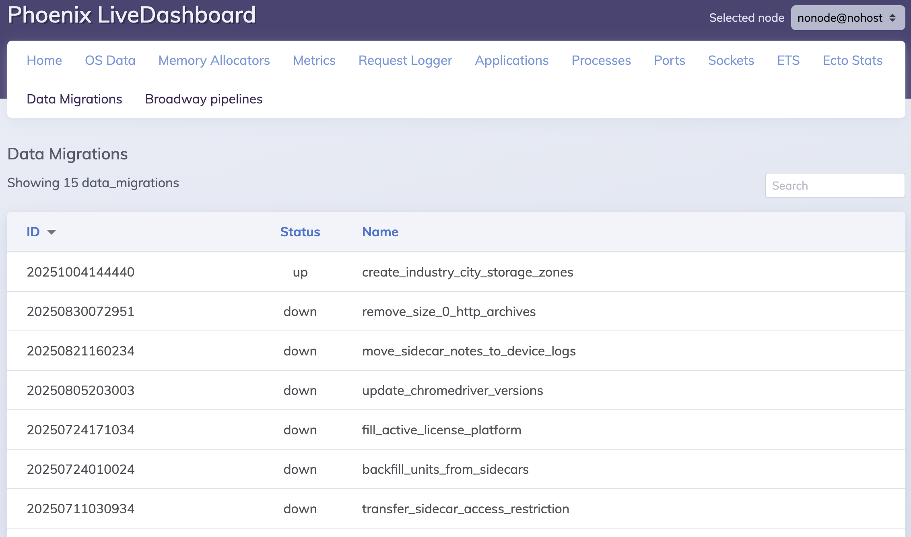
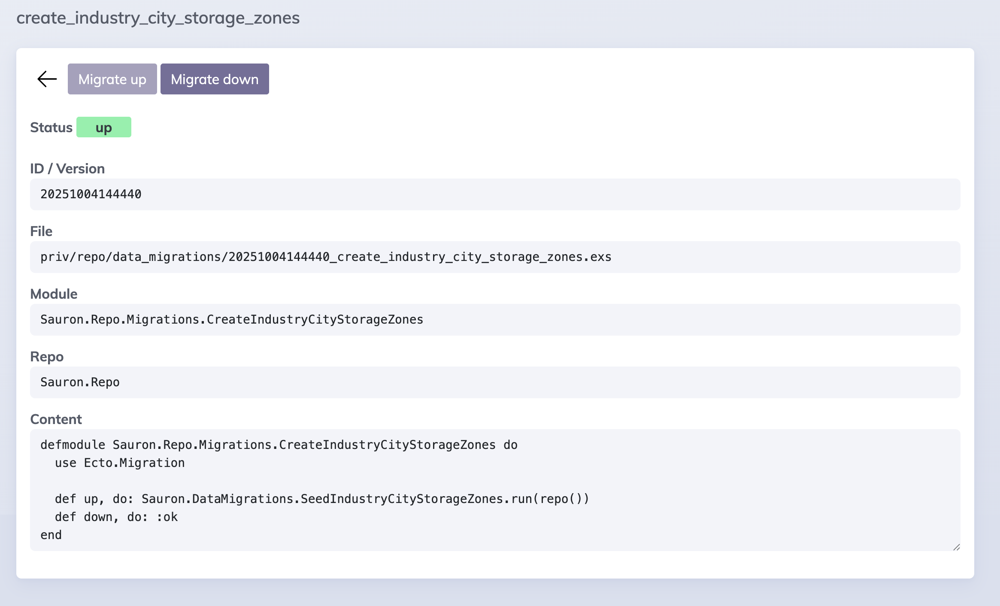
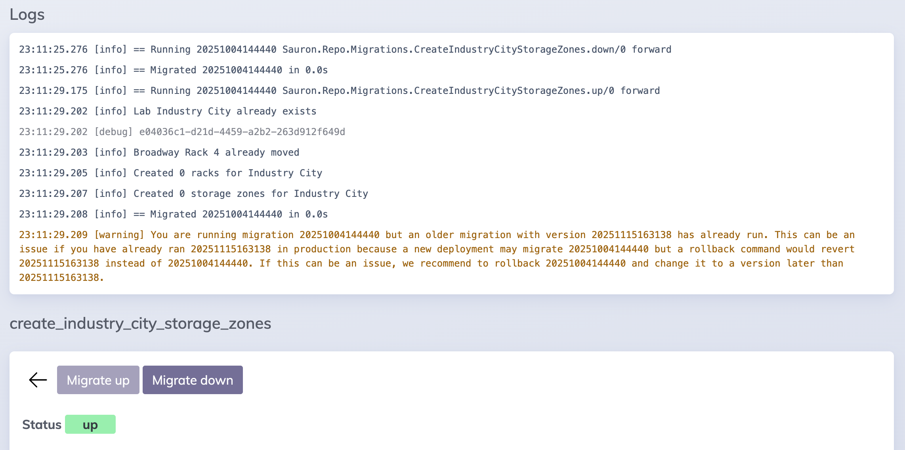

<!-- badges -->

[](https://hex.pm/packages/data_migration)
[](https://hexdocs.pm/data_migration)
[](./LICENSE)

# Data Migration

You're reading the main branch's readme. Please visit
[hexdocs](https://hexdocs.pm/data_migration) for the latest published documentation.

<!-- MDOC !-->

View [Ecto](https://hexdocs.pm/ecto_sql) Data Migrations and run them from a [Phoenix LiveDashboard](https://hexdocs.pm/phoenix_live_dashboard) page. Streams logs as
the data migrations runs to the dashboard.

For example, in your Phoenix router:

```elixir
live_dashboard "/my/admin/dashboard",
  # must have `allow_destructive_actions: true` in order to run data migrations
  # otherwise it will be view-only to see the status
  allow_destructive_actions: true,
  # Provide the page with Repo and migration folders config
  additional_pages: [
    # so the route becomes "/my/admin/dashboard/data_migrations"
    data_migrations: {
      DataMigration.LiveDashboard.Page,
      {MyApp.PubSub, %{MyApp.Repo => ["data_migrations"]}, options}
      # These paths will be passed into `Ecto.Migrator.migrations_path(repo, path)`
      # `options` is optional; you may supply 2 item tuple instead to omit options
    }
  ]
```

Options you may supply to the page:

- `:topic` a different PubSub topic to listen to for capturing migration logs.
- `:listen_for_logs` A list of MFAs (tuple of length 1, 2, or 3) for which the page to listen for logs.
    You can also supply a module namespace, eg, `MyApp.DataMigration` and any module under that namespace
    will have its logs listened to, eg `MyApp.DataMigration.FooBar`. By default,
    the app will listen to `Ecto.Adapters.SQL`, Ecto.Migration.Runner, and `Ecto.Migrator` for logs.


Requires OTP 27+

### Screenshots








